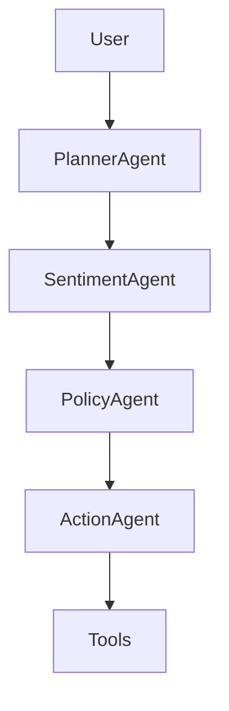

# AI Proactive Customer Operations

Multi-agent DAG orchestration workflow for AI-driven decision automation.

## Agent DAG

## Agent Graph
planner → sentiment → policy → action

### Highlights
multi-agent workflow, 
observable reasoning trace, 
tool abstraction and 
modular agent roles.

## License
MIT
