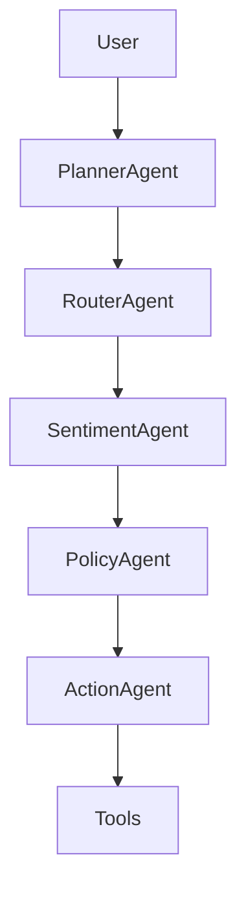

# AI Proactive Customer Operations

Multi-agent customer operations workflow that routes a customer message through
planning, intent routing, sentiment analysis, policy selection, and action
execution.

## Agent DAG



## API

- `GET /health`
- `POST /decide`

Example:

```json
{
  "message": "My package is delayed but I just need help",
  "customer_id": "cust_002"
}
```

## Run

```bash
pip install -r requirements.txt
python -m pytest -q
python evaluation/evaluate.py
uvicorn api.server:app --reload --port 8000
```

## Highlights

- Explicit trace for planner, route, sentiment, policy, and action.
- Tool-backed actions for tickets, credits, refunds, tracking updates, and knowledge responses.
- Domain sample data with expected policy/action labels.
- Evaluation script for policy/action accuracy.

## License

MIT
