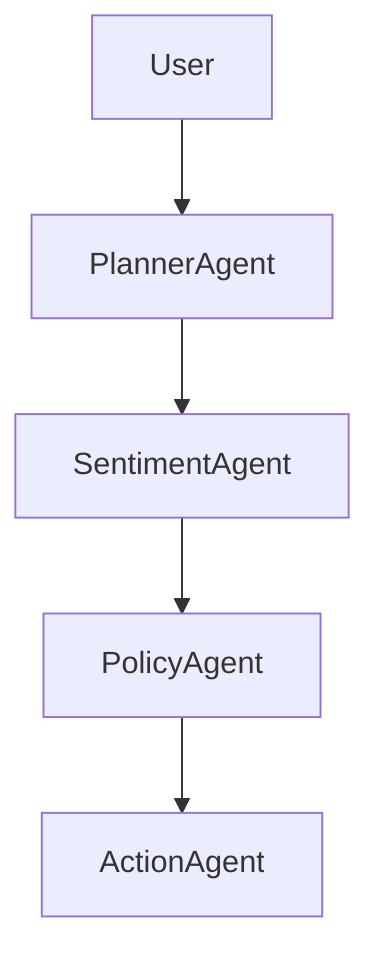

# AI Proactive Customer Operations

Explicit multi-agent DAG workflow system.

## Architecture

## Reasoning Trace Example

{
"sentiment":"negative",
"policy":"escalate",
"action":"create_ticket"
}
