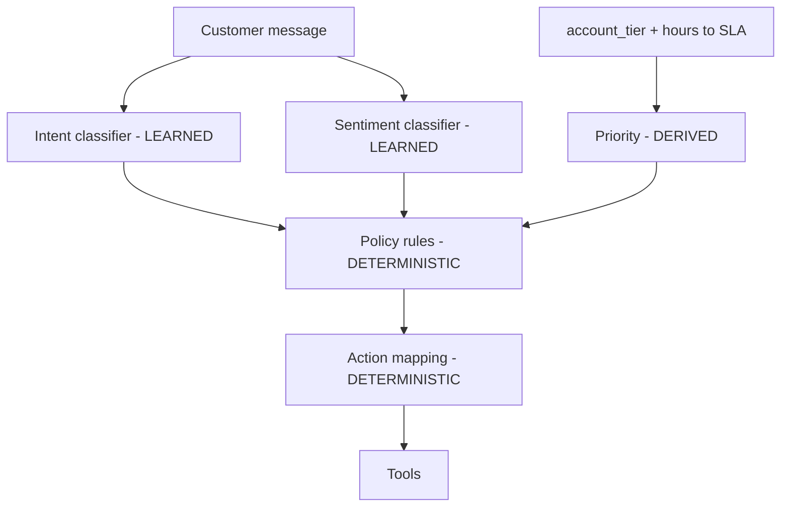

# AI Proactive Customer Operations

A multi-agent workflow that classifies a customer message with **fitted
classifiers**, derives priority from CRM facts, and then decides policy and
action with **deterministic, auditable rules**.

> **Training data is synthetic.** It is generated by
> `training/generate_corpus.py` (seeded and reproducible), not real customer
> messages. The metrics below are real measurements on a held-out split, but they
> do not establish real-world performance.

## Architecture


```mermaid
flowchart TD
  Message[Customer message] --> Intent[Intent classifier - LEARNED]
  Message --> Sentiment[Sentiment classifier - LEARNED]
  CRM[account_tier + hours to SLA] --> Priority[Priority - DERIVED]
  Intent --> Policy[Policy rules - DETERMINISTIC]
  Sentiment --> Policy
  Priority --> Policy
  Policy --> Action[Action mapping - DETERMINISTIC]
  Action --> Tools
```

| Stage | Implementation | Why |
|---|---|---|
| Intent | Fitted classifier | Free text is where a model earns its place |
| Sentiment | Fitted classifier | Same |
| Priority | Derived from `account_tier` and hours to SLA | These are facts the CRM already holds; reading urgency out of the words was part of what made the old pipeline circular |
| Policy | **Rules** (`agents/policy_agent.py`) | A system that decides refunds and escalations must be auditable and changeable without retraining |
| Action | **Rules** (`agents/action_agent.py`) | Pure mapping from policy |

The policy layer is not learned **on purpose**. Every trace names the rule that
fired, so any decision can be audited line by line. That is a deliberate design
choice, not a missing model.

## Results

Evaluated on **held-out templates**: 20 phrasings are removed from training
entirely, so every test message is worded in a way the classifiers have never
seen.

| Component | Macro-F1 | Accuracy |
|---|---|---|
| Intent (5 classes) | **0.6476** | 0.6403 |
| Sentiment (3 classes) | **0.9121** | 0.9435 |

| End-to-end (rules on predicted labels) | |
|---|---|
| Policy accuracy | **0.6468** |
| Action accuracy | **0.6468** |

### Why these numbers are lower than you might expect — and why that is the point

The same pipeline, on the same data, split by **row** instead of by template
scores **1.00 intent macro-F1**. That number is worthless: a row-level split puts
the same phrasings in train and test, so the classifier only has to recognise
wording it has already memorised.

That inflated figure is deliberately kept in `models/artifacts/metrics.json`
under `naive_row_split_contrast`, labelled as inflated, and a test asserts it
stays labelled. Keeping it visible is what stops it being quoted.

**0.6476 on unseen phrasings is the honest number.** Chance on 5 classes is ~0.20.

End-to-end accuracy (0.6468) sits below sentiment's 0.9121 because a single error
in *either* classifier changes the downstream decision. That compounding is a real
property of the architecture, so both levels are reported rather than only the
flattering one.

Full details: [`models/artifacts/model_card.md`](models/artifacts/model_card.md).

## API

- `GET /health` — status plus the identity of the loaded classifiers
- `GET /metrics`
- `GET /events` protected when `API_KEY` is set
- `POST /decide`

```json
{
  "message": "my parcel still has not turned up and I am losing patience",
  "customer_id": "cust_002",
  "account_tier": "enterprise",
  "created_at": "2026-04-06T09:00:00+00:00",
  "sla_due_at": "2026-04-06T13:00:00+00:00"
}
```

The response is a full trace: each classification with its confidence and source,
the derived priority with the fields behind it, the policy with the **name of the
rule that fired**, the action, and a `needs_human_review` flag when either
classifier was below its confidence floor.

Set `API_KEY` to require `X-API-Key` on decision/event endpoints.
Set `APP_DB_PATH` to control the SQLite event database location.

## Optional LLM backend

Intent and sentiment can be classified by an LLM instead. No vendor is hardcoded:

```
LLM_PROVIDER   openai_compatible | anthropic | none   (default: none)
LLM_API_KEY    your key
LLM_MODEL      model identifier
LLM_BASE_URL   endpoint override (self-hosted, gateways, Ollama, vLLM)
```

Default is `none`. **Every metric above comes from the fitted classifier path.**
LLM results would depend on a vendor, a model version and a sampling temperature,
and no reviewer could reproduce them.

## Run

```bash
pip install -r requirements.txt
python -m pytest -q
python evaluation/evaluate.py
uvicorn api.server:app --reload --port 8000
```

Artifacts are committed, so the service runs on a fresh clone. To regenerate:

```bash
python training/generate_corpus.py
python training/train.py
```

To confirm the committed corpus and classifiers are reproducible — this is what
CI runs:

```bash
python training/generate_corpus.py --check
python training/train.py --verify
```

With the server running, use a second terminal:

```bash
python scripts/smoke_test.py
```

Docker:

```bash
cp .env.example .env
docker compose up --build
```

Kubernetes manifests live in `k8s/deployment.yaml` and include probes, resource
limits, a Service, and a PVC for the SQLite event store.

## Reviewer Status

**What is real and independently checkable:**

- Two fitted classifiers replacing two keyword lookups. The old `route_request`
  matched the substrings "refund", "delay" and "track"; the old sentiment check
  was a 12-word set that scored *"this is the third time I have written and
  nobody replies"* as neutral. A test now asserts that exact case is negative.
- **Held-out-template evaluation**, with a test asserting train and test share no
  template.
- Two-level metrics: per-component and end-to-end.
- The inflated naive-split number retained and labelled, not deleted.
- Deterministic policy rules with named attribution in every trace.
- Corpus and training reproducible, verified in CI.

**What is explicitly not real:**

- **The data is synthetic** and template-generated. Real inboxes carry
  multi-intent messages, forwarded threads, and code-switching; none appear here.
- Single-label intent: a message asking for both a refund and tracking gets one label.
- No confidence-based routing to human review beyond a flag in the trace.
- Priority uses tier and SLA only — no customer history or lifetime value.
- Actions are simulated tool calls; nothing issues a real refund or credit.
- The SQLite event store is an audit trail for demos, not a production system.
- Docker/Compose/Kubernetes config is validated by static inspection and CI image
  builds; **cloud deployment is pending and unverified**.

**Shared scaffolding:** HTTP hardening (`utils/security.py`), the event store
(`utils/storage.py`) and the metrics surface follow a common service template
shared with the other Python services in this portfolio. That is deliberate reuse.

**Portfolio index:** https://github.com/Adityansh-Chand/ai-engineering-portfolio

## Highlights

- Learned classification in front, deterministic auditable decisions behind.
- Held-out-template evaluation that measures generalisation, not memorisation.
- The misleading naive-split result kept visible and labelled as a warning.
- Full decision traces naming the rule behind every outcome.
- Priority derived from CRM facts rather than sniffed from message text.
- Provider-agnostic optional LLM backend that no reported metric depends on.
- Quality gate in CI asserting both component and end-to-end performance.

## License

MIT
