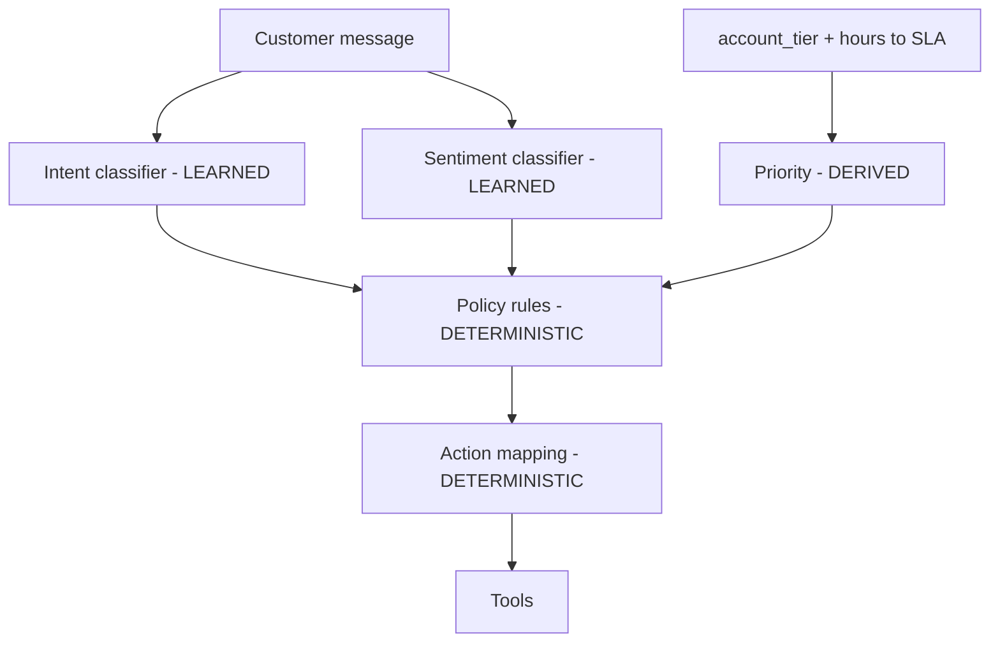

# AI Proactive Customer Operations

A multi-agent workflow that classifies a customer message with **fitted
classifiers**, derives priority from CRM facts, and then decides policy and
action with **deterministic, auditable rules**.

> **The served classifiers are trained on synthetic data**, generated by
> `training/generate_corpus.py` (seeded and reproducible), not real customer
> messages. Those metrics are real measurements on a held-out split, but they do
> not establish real-world performance.
>
> **The intent pipeline is separately validated on real messages** — 13,083
> queries real customers sent an online bank ([BANKING77](https://huggingface.co/datasets/PolyAI/banking77)),
> reaching **macro-F1 0.9164** across 77 intents. See
> [Validation on real data](#validation-on-real-data).

## Architecture


```mermaid
flowchart TD
  Message[Customer message] --> Intent[Intent classifier - LEARNED]
  Message --> Sentiment[Sentiment classifier - LEARNED]
  CRM[account_tier + hours to SLA] --> Priority[Priority - DERIVED]
  Intent --> Policy[Policy rules - DETERMINISTIC]
  Sentiment --> Policy
  Priority --> Policy
  Policy --> Action[Action mapping - DETERMINISTIC]
  Action --> Tools
```

| Stage | Implementation | Why |
|---|---|---|
| Intent | Fitted classifier | Free text is where a model earns its place |
| Sentiment | Fitted classifier | Same |
| Priority | Derived from `account_tier` and hours to SLA | These are facts the CRM already holds; reading urgency out of the words was part of what made the old pipeline circular |
| Policy | **Rules** (`agents/policy_agent.py`) | A system that decides refunds and escalations must be auditable and changeable without retraining |
| Action | **Rules** (`agents/action_agent.py`) | Pure mapping from policy |

The policy layer is not learned **on purpose**. Every trace names the rule that
fired, so any decision can be audited line by line. That is a deliberate design
choice, not a missing model.

## Results

Evaluated on **held-out templates**: 20 phrasings are removed from training
entirely, so every test message is worded in a way the classifiers have never
seen.

| Component | Macro-F1 | Accuracy |
|---|---|---|
| Intent (5 classes) | **0.6476** | 0.6403 |
| Sentiment (3 classes) | **0.9121** | 0.9435 |

| End-to-end (rules on predicted labels) | |
|---|---|
| Policy accuracy | **0.6468** |
| Action accuracy | **0.6468** |

### Why these numbers are lower than you might expect — and why that is the point

The same pipeline, on the same data, split by **row** instead of by template
scores **1.00 intent macro-F1**. That number is worthless: a row-level split puts
the same phrasings in train and test, so the classifier only has to recognise
wording it has already memorised.

That inflated figure is deliberately kept in `models/artifacts/metrics.json`
under `naive_row_split_contrast`, labelled as inflated, and a test asserts it
stays labelled. Keeping it visible is what stops it being quoted.

**0.6476 on unseen phrasings is the honest number.** Chance on 5 classes is ~0.20.

End-to-end accuracy (0.6468) sits below sentiment's 0.9121 because a single error
in *either* classifier changes the downstream decision. That compounding is a real
property of the architecture, so both levels are reported rather than only the
flattering one.

Full details: [`models/artifacts/model_card.md`](models/artifacts/model_card.md).

## Validation on real data

Held-out *templates* keep the synthetic evaluation honest, but they cannot fix the
fact that every sentence in that corpus shares one author. This track runs the
**same pipeline** against [BANKING77](https://huggingface.co/datasets/PolyAI/banking77)
(CC BY 4.0) — 13,083 messages real customers sent an online bank, across 77
fine-grained intents.

```bash
python training/fetch_real_data.py
python training/train_real.py
```

| Metric | Value |
|---|---|
| **Macro-F1** | **0.9164** |
| Accuracy | 0.9162 |
| Classes | 77 |
| Random-guess accuracy | 0.013 |

The **official train/test split is used as shipped**, so these sit on the same
split as published work rather than one chosen here.

### The number was checked before it was published

0.9164 across 77 classes is high enough to be suspicious, so it was tested rather
than trusted. Verbatim overlap between the two official files is **6 messages,
0.195% of the test set** — far too small to explain the result, and a property of
the dataset rather than of any split made here. That check runs on every training
run and a test fails if the overlap ever rises above 1%.

The test set is balanced at 40 examples per class, which is why macro-F1 and
accuracy nearly coincide. On an imbalanced set they would diverge and macro-F1
would be the one to read.

The honest explanation is that these queries are lexically distinctive — a lost
card and a declined transfer share almost no vocabulary — and character n-grams
absorb the typos. That suits a sparse linear model better than expected.

### Where it fails

| Hardest intent | F1 |
|---|---|
| `balance_not_updated_after_bank_transfer` | 0.7470 |
| `top_up_failed` | 0.8101 |
| `failed_transfer` | 0.8182 |

The failures are near neighbours, not random errors: intents that differ by
circumstance rather than vocabulary, where bag-of-n-grams has little to work with.
A sentence encoder would close most of that gap. That this model cannot is a
property of the representation, and it is reported rather than averaged away.

### Scope, stated plainly

**Intent only.** BANKING77 carries no sentiment labels, so the sentiment
classifier is still validated on synthetic data alone and nothing here implies
otherwise.

The two macro-F1 figures — 0.6476 synthetic, 0.9164 real — are **not comparable
and are not compared**: one is 5-way on our phrasing with held-out templates, the
other 77-way on real phrasing with the official split. The real task has more
classes; the synthetic one has an adversarial split. What carries across is that
the same pipeline handles both.

Full details: [`models/artifacts/real/model_card.md`](models/artifacts/real/model_card.md).

## API

- `GET /health` — status plus the identity of the loaded classifiers
- `GET /metrics`
- `GET /events` protected when `API_KEY` is set
- `POST /decide`

```json
{
  "message": "my parcel still has not turned up and I am losing patience",
  "customer_id": "cust_002",
  "account_tier": "enterprise",
  "created_at": "2026-04-06T09:00:00+00:00",
  "sla_due_at": "2026-04-06T13:00:00+00:00"
}
```

The response is a full trace: each classification with its confidence and source,
the derived priority with the fields behind it, the policy with the **name of the
rule that fired**, the action, and a `needs_human_review` flag when either
classifier was below its confidence floor.

Set `API_KEY` to require `X-API-Key` on decision/event endpoints.
Set `APP_DB_PATH` to control the SQLite event database location.

## Optional LLM backend

Intent and sentiment can be classified by an LLM instead. No vendor is hardcoded:

```
LLM_PROVIDER   openai_compatible | anthropic | none   (default: none)
LLM_API_KEY    your key
LLM_MODEL      model identifier
LLM_BASE_URL   endpoint override (self-hosted, gateways, Ollama, vLLM)
```

Default is `none`. **Every metric above comes from the fitted classifier path.**
LLM results would depend on a vendor, a model version and a sampling temperature,
and no reviewer could reproduce them.

### Distributed tracing

Every event is stored with the request id that produced it, and `/v1/events`
accepts a `request_id` filter. That is what makes a cross-service trace joinable:
the id already crossed service boundaries, but until it was recorded next to the
event there was nothing to join on.

```bash
curl "localhost:8000/v1/events?request_id=demo-1a2b3c4d"
```

The portfolio repo's `scripts/trace.py` asks all five services this question and
merges the answers into one ordered timeline.

## API versioning

Data endpoints are served under **`/v1`**. The same endpoints remain available at
the unversioned path as a **deprecated alias**, so consumers written before
versioning keep working; new callers should use `/v1`.

```bash
curl localhost:8000/version
```

`/health`, `/metrics` and `/version` are deliberately **not** versioned. They
describe the process rather than the API, and a monitoring system should not have
to follow an API version bump to keep scraping.

Both paths are served by one set of handlers, so the alias cannot drift from the
versioned route. `tests/test_api_versioning.py` asserts every data endpoint is
reachable under `/v1`, that the alias still exists, and that infrastructure
endpoints stay unversioned.

Why it matters here: without a version prefix there is no way for this service to
change a response shape without breaking every consumer on the same deploy. The
consumer-driven contract checks in the portfolio repo *detect* that breakage —
they do not prevent it.

## Run

```bash
pip install -r requirements.txt
python -m pytest -q
python evaluation/evaluate.py
uvicorn api.server:app --reload --port 8000
```

Artifacts are committed, so the service runs on a fresh clone. To regenerate:

```bash
python training/generate_corpus.py
python training/train.py
```

To confirm the committed corpus and classifiers are reproducible — this is what
CI runs:

```bash
python training/generate_corpus.py --check
python training/train.py --verify
```

With the server running, use a second terminal:

```bash
python scripts/smoke_test.py
```

Docker:

```bash
cp .env.example .env
docker compose up --build
```

Kubernetes manifests live in `k8s/deployment.yaml` and include probes, resource
limits, a Service, and a PVC for the SQLite event store.

## Cross-service integration (optional)

This service is the hub of the wider system. It can enrich a decision with three
other services, and **every one of them is optional**:

```
SALES_API_URL       account propensity for the customer who wrote in
INCIDENT_API_URL    is the service they are complaining about degraded?
RAG_API_URL         a grounding passage for the reply
INTEGRATION_API_KEY X-API-Key for all three, when they require one
```

Unset them and this service behaves exactly as documented above — the offline
evaluation, the committed metrics, and all 32 standalone tests are unaffected,
because enriched policy rules are **additive** and cannot fire without enrichment
data. A test asserts that.

What the edges change:

| Enrichment | Effect |
|---|---|
| Active incident on the service | Policy becomes `incident_response` — the customer is linked to a known fault rather than issued an individual refund for something already being fixed |
| High-propensity account, negative sentiment | Escalates for retention |
| Retrieved passage | Grounds the reply |

**An enrichment may improve a decision, but it may never prevent one.** Each call
has a short timeout, one bounded retry, and a circuit breaker that stops calling a
dead dependency. Every outcome — `ok`, `not_configured`, `timeout`, `circuit_open`,
`error` — is recorded in the trace, and `policy.used_enrichment` says whether the
decision actually depended on another service.

`tests/test_integration.py` covers both paths against a real HTTP server: an
unreachable dependency, a slow one, request-id propagation, and the connected
cases. Writing those tests caught a real bug — the timeout was read at import
time, so it could never have been reconfigured at runtime.

### Receiving events -- proactive outreach (optional)

`POST /events/incident` accepts events from the incident platform. This is the
only path in the service that starts without a customer asking, and it is what
makes the name literally true.

When a service becomes degraded, customers who recently contacted us **about that
service** are notified that their problem is a known fault being worked on --
unprompted. `GET /proactive/outreach` shows what was sent.

Two things make this honest rather than decorative:

- **Idempotency.** Inbound delivery is at-least-once, so the same event will
  sometimes arrive twice. The handler deduplicates by `event_id`; a test asserts
  a redelivery does not message the same customers again. Without that, a
  delivery retry becomes a second message to the same person -- exactly the bug
  that makes people distrust automated outreach.
- **The audience comes from data this service actually holds.** A recent-contact
  registry is populated by `/decide` itself. There is no customer database here,
  and inventing one would be pretending: anyone who never wrote in is not
  reachable from this service, and the response says so.

## Reviewer Status

**What is real and independently checkable:**

- Two fitted classifiers replacing two keyword lookups. The old `route_request`
  matched the substrings "refund", "delay" and "track"; the old sentiment check
  was a 12-word set that scored *"this is the third time I have written and
  nobody replies"* as neutral. A test now asserts that exact case is negative.
- **Held-out-template evaluation**, with a test asserting train and test share no
  template.
- Two-level metrics: per-component and end-to-end.
- The inflated naive-split number retained and labelled, not deleted.
- Deterministic policy rules with named attribution in every trace.
- Corpus and training reproducible, verified in CI.

**What is explicitly not real:**

- **The served classifiers' data is synthetic** and template-generated. Real
  inboxes carry multi-intent messages, forwarded threads, and code-switching; none
  appear here. The intent *pipeline* is validated on real messages
  ([above](#validation-on-real-data)), but that model is not the one serving
  `/decide`, and sentiment has no real-data validation at all.
- Single-label intent: a message asking for both a refund and tracking gets one label.
- No confidence-based routing to human review beyond a flag in the trace.
- Priority uses tier and SLA only — no customer history or lifetime value.
- Actions are simulated tool calls; nothing issues a real refund or credit.
- The SQLite event store is an audit trail for demos, not a production system.
- Docker/Compose/Kubernetes config is validated by static inspection and CI image
  builds; **cloud deployment is pending and unverified**.

**Shared scaffolding:** HTTP hardening (`utils/security.py`), the event store
(`utils/storage.py`) and the metrics surface follow a common service template
shared with the other Python services in this portfolio. That is deliberate reuse.

**Portfolio index:** https://github.com/Adityansh-Chand/ai-engineering-portfolio

## Highlights

- Learned classification in front, deterministic auditable decisions behind.
- Held-out-template evaluation that measures generalisation, not memorisation.
- The misleading naive-split result kept visible and labelled as a warning.
- Full decision traces naming the rule behind every outcome.
- Priority derived from CRM facts rather than sniffed from message text.
- Provider-agnostic optional LLM backend that no reported metric depends on.
- Quality gate in CI asserting both component and end-to-end performance.

## License

MIT
